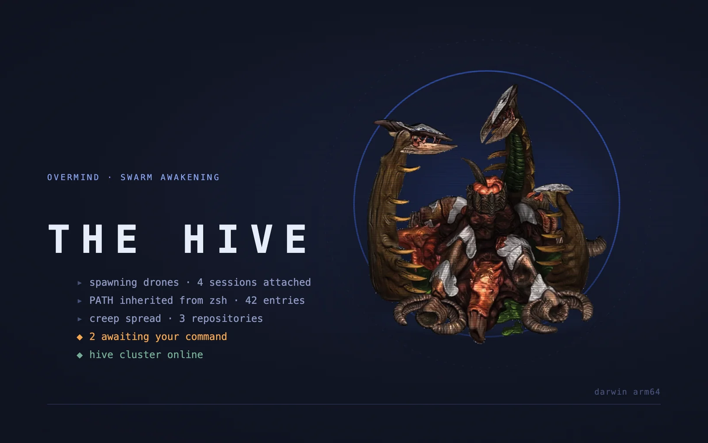
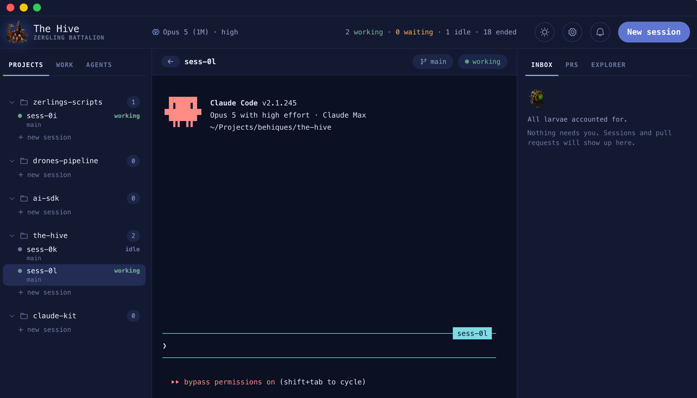

[](https://github.com/yunidbauza/the-hive/releases/latest)
[](https://github.com/yunidbauza/the-hive/releases)
[](https://github.com/yunidbauza/the-hive/issues)
[](LICENSE)

# The Hive

**Inspired by the alien race Zerg, of Blizzard's StarCraft masterpiece: one swarm, many
strains, an overmind keeping them in check.**

Every session is a real `claude` process in a real PTY, unchanged in every way that
matters: same keys, same output, same conversation. Around it, the things you would
otherwise leave the terminal for, like Jira tickets, pull requests, a file explorer and
editor, custom skills, and an inbox that surfaces the session waiting on you.

Built for Claude Code.



---

## What it actually does


**Runs the terminals.** Real PTYs through `node-pty`, rendered by xterm.js, one per
session. Spawn from a project, a Jira ticket, or the console: `spawn the-hive "fix the
lead form"`.

**Notices when one needs you.** Claude Code's hooks report into The Hive, so a session
that asks a permission question or finishes its turn raises an inbox item instead of
scrolling past unread in a tab you were not looking at.

**Keeps the work in view.** Jira tickets, `gh` pull requests and the branch each
session is on, resolved against the fleet, so a PR row knows which terminal made it.

**Opens the repository.** The right rail's third tab is a project explorer over the
active session's checkout, opening files into a CodeMirror editor on the centre stage.

**Carries skills of your own.** Markdown under `~/.hive/skills` is injected into every
session The Hive starts and into no other `claude`. Settings has an editor for them,
and so does your editor: the tree is re-read before every spawn either way.

**Follows a theme all the way down.** Themes are built in or imported from a file, and
they reach the terminal and the code editor as well as the chrome, because xterm and
CodeMirror both take their palette from the active theme rather than from a stylesheet
somebody has to keep in sync.

**Ends cleanly.** `/done` finishes a session and closes its terminal, and the row stays
readable afterwards, with Resume, which continues the same conversation.

<br clear="all">

## Install

Grab the `.dmg` from [the latest
release](https://github.com/yunidbauza/the-hive/releases/latest). macOS arm64, with
auto-update built in. There is no Homebrew cask yet.

Linux has no release artifact, so run it from source there. The same two commands work
on macOS:

```sh
pnpm install
pnpm desktop:dev
```

## Requirements

To run The Hive at all:

- **Claude Code**, on your `PATH`. Every session is a real `claude` process. The
  command defaults to `claude` and can be overridden per project with `claudeCommand`
  in `~/.hive/config.json`.
- **git**, for the branch each session is on.
- **[`gh`](https://cli.github.com)**, authenticated with `gh auth login`. The pull
  requests panel is `gh` underneath; without it that panel stays empty.
- **A Jira account**, only if you want the work panel. It is configured in Settings,
  and the panel says so rather than breaking when it is not.

To build from source:

- **Node**, the major pinned in [`.nvmrc`](.nvmrc) (22)
- **pnpm**, pinned via `packageManager` in `package.json`
- **Chromium**, for `pnpm test:e2e` only. `pnpm install` does not fetch browser
  binaries, so run `pnpm exec playwright install chromium` once per machine.

### Native toolchain (desktop target only)

`node-pty` is a native addon. `pnpm install` handles it on a clean checkout, but the
compiler toolchain has to be present if a prebuild is ever unavailable for your
platform:

| Platform | Needs |
| --- | --- |
| macOS | Xcode Command Line Tools (`xcode-select --install`) |
| Linux | `build-essential` and `python3` |
| Windows | **Not supported.** See the gap below. |

**Windows is a known gap.** This project targets macOS and Linux. Windows terminals go
through ConPTY/`winpty` rather than a POSIX pty, and `titleBarStyle: 'hiddenInset'` is
not honoured there either. It is its own body of work, deliberately not attempted.

Two facts about the native module that produce unreadable errors when forgotten:

- **`node-pty@1.1.0` ships N-API prebuilds, so it does *not* need rebuilding for
  Electron.** N-API is ABI-stable across Node versions and across Electron. Verified on
  this tree: the same `prebuilds/darwin-arm64/pty.node` spawns a working PTY under
  plain Node (ABI 127) and under Electron (ABI 148). Running `electron-rebuild`
  unconditionally would *replace* that portable prebuild with an ABI-locked one.
  `pnpm rebuild:pty` exists for the case that genuinely needs it: no prebuild for your
  platform (musl, some Linux arches), where `node-pty` falls back to `node-gyp rebuild`,
  and that build *is* Node-ABI-locked.
- **The published `spawn-helper` has no executable bit.** `node-pty@1.1.0` ships
  `prebuilds/<platform>-<arch>/spawn-helper` as mode `0644` in the tarball itself, so
  every package manager reproduces it, and the package's own `post-install.js` only
  chmods `build/Release/`, which a prebuild install never populates. The symptom is
  `Error: posix_spawnp failed.` on the first spawn, *after* `require` has already
  succeeded. `postinstall` repairs it automatically; `pnpm check:abi --fix` repairs it
  by hand.

## Commands

| Command | What it does |
| --- | --- |
| `pnpm desktop:dev` | The **Electron** app, with renderer HMR |
| `pnpm desktop:build` | Type-check, then build `out/{main,preload,renderer}/` |
| `pnpm desktop:preview` | Run the built Electron app |
| `pnpm desktop:dist` | Package `.dmg` + `.zip` into `dist/` (macOS arm64) |
| `pnpm dev` | Vite dev server, the **browser** target (no PTYs, no Jira, no config) |
| `pnpm build` | Type-check, then a production build of the browser target |
| `pnpm lint` | ESLint across `src/`, `electron/` and config |
| `pnpm type-check` | `tsc --noEmit` for the app, the Node configs, and `electron/` |
| `pnpm test` | Vitest, single run |
| `pnpm test:coverage` | Vitest with the 80% coverage gate |
| `pnpm test:e2e` | Playwright, the web specs and the packaged app |
| `pnpm test:pty` | PTY conformance: real PTYs, Electron ABI, no UI |
| `pnpm verify:boundaries` | Proves every architecture fence still fires |

**`pnpm lint` and `pnpm type-check` must both pass before any task is considered
done.** Neither is optional, and no rule may be disabled inline to make a task pass.

There are also six live conformance suites, `pnpm test:hooks`, `:statusline`,
`:skills`, `:done`, `:ready` and `:back`, which run against a **real `claude` binary**
rather than a mock, because what Claude Code's hooks actually send, and what a real
session actually draws, are not things a fake can tell you.

## Stack

React 19 · TypeScript (strict) · Vite · Electron · xterm.js · CodeMirror 6 · Zustand ·
Tailwind v4 · shadcn/ui · pnpm

## Architecture, in one paragraph

Four stores, split by what they answer: what the system *knows*, what the user is
*looking at*, what they have *chosen*, and what they have *open*. One import fence per
feature slice, enforced by ESLint rather than by review. And one invariant above all
the others: **`src/components/terminal/` speaks only `TerminalTransport`**, and may not
import from `features/`, `data/` or `stores/`. That seam is why the terminal survived
the move from a scripted fake to a real PTY with no changes to the component tree.

`pnpm verify:boundaries` proves each fence still fires.

The deep dives live in [`docs/`](docs/), and the visual source of truth is
[`.claude/DESIGN-SYSTEM.md`](.claude/DESIGN-SYSTEM.md).

## License

[Apache 2.0](LICENSE) © Yunid Bauza
