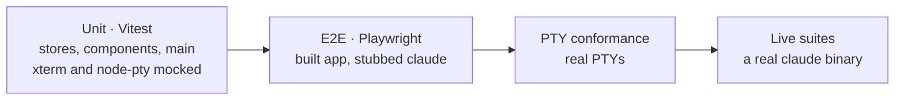

# Contributing

How to build, test and verify a change. The rules for code live in
[`AGENTS.md`](../AGENTS.md); this page is the commands.

**On this page:** [Set up](#set-up) · [Commands](#commands) · [Test layers](#test-layers) ·
[Live suites](#live-suites) · [Definition of done](#definition-of-done)

## Set up

```sh
nvm use                                   # Node 22 from .nvmrc
pnpm install
pnpm exec playwright install chromium     # once per machine, for e2e
pnpm desktop:dev
```

## Commands

| Command | Does |
| --- | --- |
| `pnpm desktop:dev` | the Electron app, with renderer hot reload |
| `pnpm desktop:build` | type-check, then build `out/{main,preload,renderer}/` |
| `pnpm desktop:preview` | run the built app |
| `pnpm desktop:dist` | package `.dmg` and `.zip` into `dist/` (macOS arm64) |
| `pnpm dev` | the browser target: chrome only, no PTYs, Jira or config |
| `pnpm lint` | ESLint over `src/`, `electron/` and config |
| `pnpm type-check` | `tsc --noEmit` for app, Node configs and `electron/` |
| `pnpm test` | Vitest, single run |
| `pnpm test:coverage` | Vitest with the 80% gate |
| `pnpm test:e2e` | Playwright: web specs and the built app |
| `pnpm test:pty` | PTY conformance: real PTYs, Electron ABI, no UI |
| `pnpm verify:boundaries` | proves every architecture fence still fires |

Run one spec with `pnpm exec vitest run <path>`; `pnpm test -- <path>` runs everything.

## Test layers



- `tests/` mirrors `src/` and `electron/`: the test for `src/features/inbox/x.tsx` is
  `tests/features/inbox/x.test.tsx`.
- xterm and `node-pty` are never loaded for real in unit tests. CodeMirror is: it renders
  without measuring.
- Timers use fake timers, never real waits.
- Electron e2e runs against `out/`; run `pnpm desktop:build` first.
- A failing e2e spec is re-run alone before it counts as red.

## Live suites

These run against a real `claude`, because what hooks actually send and what a real session
draws cannot be faked. Each costs time, some cost tokens.

| Suite | Proves |
| --- | --- |
| `pnpm test:hooks` | what Claude Code's hooks send |
| `pnpm test:statusline` | the status line payload |
| `pnpm test:skills` · `:done` | custom skills and `/done` |
| `pnpm test:ready` · `:back` · `:nudge` · `:title` | boot, the bare `←`, nudges, titling |
| `pnpm test:hook-context` · `:marker` | hook context reaches the model |
| `pnpm test:ledger` · `:mcp-http` | the ledger MCP tools, stdio and HTTP |
| `pnpm test:agent` | headless agent runs end to end |
| `pnpm test:container` | containerised sessions and agents |
| `pnpm test:server` | server mode across two real app processes |

[`AGENTS.md`](../AGENTS.md) has what each covers in full.

## Definition of done

1. `pnpm lint` passes.
2. `pnpm type-check` passes.
3. `pnpm test` passes, with coverage at 80% or more.
4. A UI change is seen working in the real app, not only in tests.

No lint rule is disabled inline and no coverage-ignore comment is added to get there.
