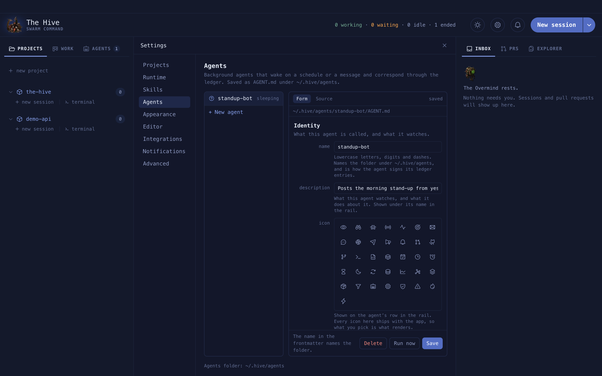
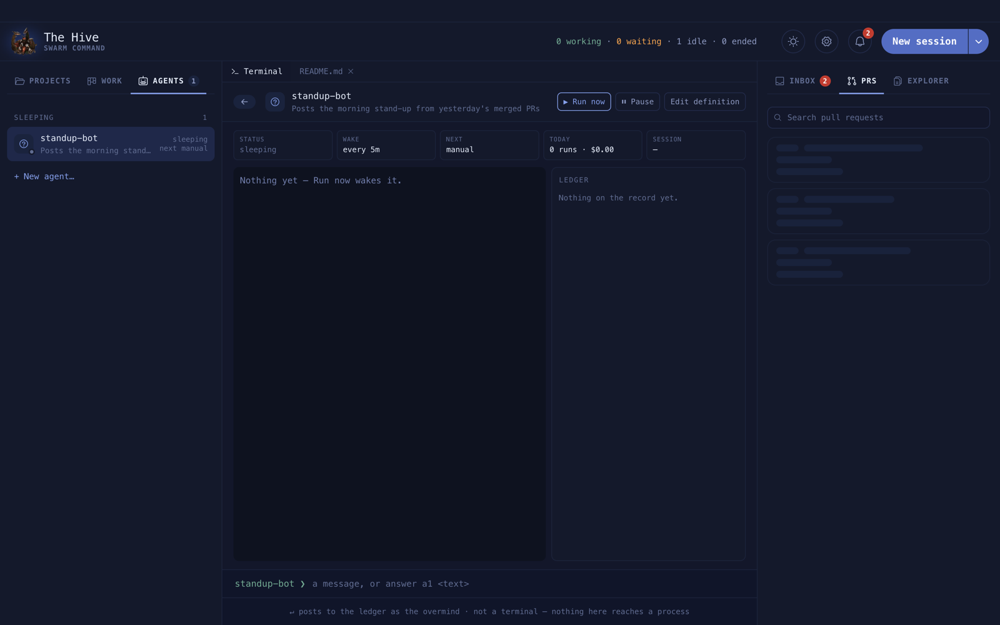
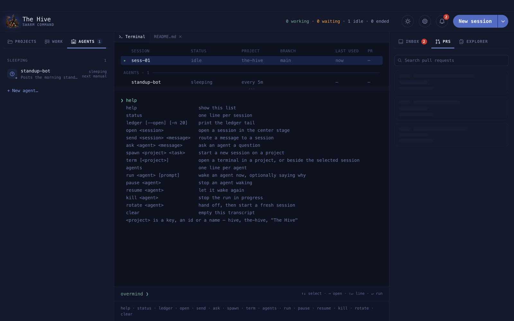

# Agents

An agent is a `claude` that works in the background. It wakes on a schedule, a message or a
Slack mention, does one job, reports through the [ledger](ledger.md), and goes back to
sleep. It asks you before it does anything you have not allowed.

**On this page:** [What an agent is](#what-an-agent-is) · [Create an agent](#create-an-agent) ·
[AGENT.md reference](#agentmd-reference) · [When an agent wakes](#when-an-agent-wakes) ·
[The tools fence](#the-tools-fence) · [Watch an agent work](#watch-an-agent-work) ·
[Task runs](#task-runs) · [Memory and rotation](#memory-and-rotation)

## What an agent is

One file, `~/.hive/agents/<name>/AGENT.md`: frontmatter that says when and how it runs, and a
body that is its standing job. Each wake is one headless `claude -p` run that resumes the
last one, so it remembers.

<picture>
  <source media="(prefers-color-scheme: dark)" srcset="../assets/diagrams/agent-wake.dark.svg">
  
</picture>

## Create an agent

**Agents tab › + New agent…** opens **Settings › Agents**. Fill in the **Form**, or switch
to **Source** and write the file. Both edit the same text. A file you write by hand shows
up without a restart, and a broken one is listed with its problem.



**Example.** An agent that checks your PRs every half hour and asks before it comments:

```yaml
---
name: pr-patrol
description: Watches my open PRs and asks before it comments on any of them
icon: ph-git-pull-request
model: sonnet
effort: medium
wake:
  every: 30m
  check: always            # the work lives on GitHub, not in the ledger
  quiet: 22:00-07:00
  on: [ledger]
tools: [Read, Grep, Bash(gh pr *)]
autonomy: ask
limits:
  turns: 30
  budget_usd: 2
  daily_usd: 10
---

Check my open pull requests with `gh pr list --author @me`.
When one has a failing check or an unanswered review comment, ask me with
ledger_ask what to do, naming the PR in the first line.
When nothing needs me, end the turn without posting.
```

Write the body as an instruction ("watch X, when you find Y, do Z"), not a description.

## AGENT.md reference

Keys are snake_case. An unknown key is an error, not ignored.

| Key | Values | Default |
| --- | --- | --- |
| `name` | lower-case, digits, dashes; equals the folder name | required |
| `description` | one line, shown in the rail | required |
| `icon` | a Phosphor icon name, like `ph-robot` | required |
| `model` / `effort` | as for sessions | Claude's default |
| `wake.every` | `5m`, `2h`, `daily` (whole minutes, at least 1m) | none |
| `wake.at` / `wake.days` | `[09:00, 17:00]` / `[mon, tue, …]` | none |
| `wake.on` | `ledger`, `slack.mention`, `slack.app_mention`, `slack.channel:#name` | none |
| `wake.quiet` | `23:00-07:00` | none |
| `wake.check` | `onchange` or `always` | `onchange` |
| `tools` | rules that run without asking: `Read`, `Bash(git *)`, `mcp__slack__*` | none |
| `autonomy` | `ask` (ask before anything consequential) or `act` | `ask` |
| `skills` | skill names to allow | none |
| `mcp` | `[slack]` | none |
| `limits.turns` | turns per wake | 40 |
| `limits.budget_usd` / `limits.daily_usd` | per-wake / per-day spend cap | none |
| `limits.rotate_after` | wakes before a fresh session | 50 |
| `limits.parallel` | task runs at once | 1 |
| `container.*` | run inside a container, see [Containers](containers.md) | none |

A `#` after two or more spaces starts a comment; after one space it is text, so
`slack.channel:#eng` works.

## When an agent wakes

| Trigger | Set by |
| --- | --- |
| Every N minutes | `wake.every` |
| At set times | `wake.at`, optionally `wake.days` |
| A ledger entry addressed to it | `wake.on: [ledger]` |
| **▶ Run now**, or `run <agent>` | you |
| A Slack mention or channel message | `wake.on: [slack.app_mention]` and Socket Mode |

- Scheduled wakes can be up to a minute late. A missed window wakes once, however long the
  app was closed.
- **Quiet hours** hold scheduled wakes; messages still wake it.
- With `check: onchange` (the default), a tick with nothing new is skipped. The **Wake** tile
  counts skips. Use `check: always` when the work lives outside the ledger.
- An agent that is **asking** skips scheduled wakes; your answer is its wake.
- `limits.daily_usd` stops scheduled wakes for the rest of the day and says so in the inbox.

## The tools fence

`tools:` lists what the agent may do **without asking**. Anything else is stopped and becomes
a permission card in your [inbox](inbox.md), showing the real call. Choose **once**, a
family like `git *`, or **all Bash**. A permanent grant is written back into `tools:`.

Commands with `;`, `&`, `|`, `<`, `>`, a backtick, `$(` or a newline are always asked. The hive ledger tools are
always allowed.

## Watch an agent work



- **Agents tab**: groups Awake, Sleeping, Paused. Asking agents sort first; the tab badge
  counts their open questions.



- **Agent view** (click an agent): **▶ Run now**, **⏸ Pause**, **Edit definition**; tiles
  for Status, Wake, Next, Today (`N runs · $X`) and Session; the **run log** (Outcome, Turns,
  Took, Cost) beside the agent's ledger.
- The box at the bottom posts to the agent. `answer a1 yes, go ahead` answers its open ask.
- To stop a run now, use `kill <agent>` in the console.

## Task runs

With `limits.parallel` above 1, `run pr-patrol review PR 1234` (or `@hive pr-patrol …` in
[Slack](slack.md)) starts a **task run**: a fresh session for one job, beside the standing
one. Past the limit, runs queue.

## Memory and rotation

Every wake resumes the same conversation. After `rotate_after` wakes, the agent is asked to
leave a handoff note, and the next wake starts a fresh session that opens with it.
`rotate <agent>` does that now.
