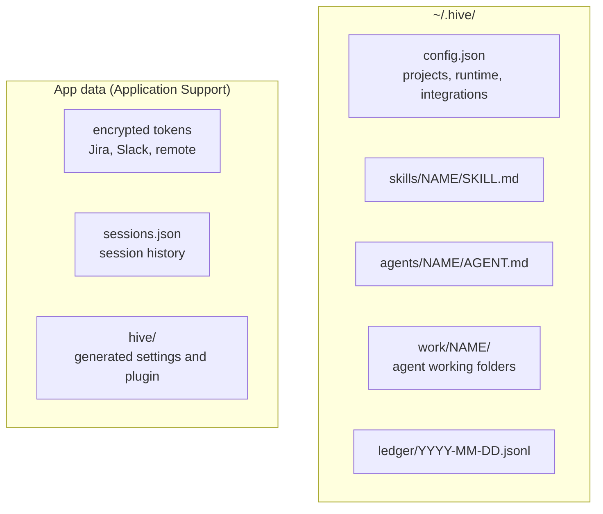

# The config file

`~/.hive/config.json` holds your projects and everything Settings changes. It is meant to stay
hand-editable. Settings writes it for you; if you edit it by hand, press **Reload** in
**Settings › Advanced**.

**On this page:** [Where it lives](#where-it-lives) · [A complete example](#a-complete-example) ·
[Top-level keys](#top-level-keys) · [Project keys](#project-keys) ·
[What is not in this file](#what-is-not-in-this-file)

## Where it lives



Set `HIVE_CONFIG_PATH` to use another file. Skills, agents and the ledger move with it.

## A complete example

```json
{
  "//": "The Hive workspace config. Keys starting with // are comments.",
  "version": 2,
  "shell": "/bin/zsh",
  "claudeCommand": "claude",
  "env": { "NODE_ENV": "development" },
  "importLoginEnv": true,
  "projects": [
    { "id": "the-hive", "key": "hive", "name": "The Hive", "path": "~/Projects/the-hive" },
    {
      "id": "nova-web",
      "key": "nw",
      "name": "NOVA Web",
      "path": "~/repos/nova-web",
      "env": { "API_URL": "http://localhost:4000" }
    }
  ],
  "jira": { "site": "your-team.atlassian.net", "email": "you@example.com" },
  "notifications": { "session.blocked": "both", "pr.merged": "inbox" },
  "slack": { "socketMode": false, "commanders": [] }
}
```

## Top-level keys

Any key not in this list makes the whole file invalid, and Settings says which.

| Key | Holds | Guide |
| --- | --- | --- |
| `version` | `2` | |
| `shell` | the login shell sessions start in | [Settings › Runtime](settings.md#runtime) |
| `claudeCommand` | what is typed to start Claude; default `claude` | [Settings › Runtime](settings.md#runtime) |
| `env` | variables for every session (not `TERM`, `COLORTERM`, `PWD`) | [Settings › Runtime](settings.md#runtime) |
| `importLoginEnv` | adopt your login shell's `PATH` at startup; default on | [Settings › Runtime](settings.md#runtime) |
| `projects` | the project list | below |
| `notifications` | kind → `off`, `inbox`, `both` | [The inbox](inbox.md#choosing-what-reaches-you) |
| `jira` | `site`, `email`, `jql` | [Jira and pull requests](work-and-prs.md#connect-jira) |
| `slack` | `socketMode`, `commanders` | [Slack](slack.md) |
| `receiver` | `hostAlias`, `bind` for containers | [Containers](containers.md) |
| `server` | serve this machine | [Remote](remote.md#serve-from-a-mac-mini) |
| `remote` | attach to a server | [Remote](remote.md#attach-from-a-laptop) |
| `subscriptionAuth` | sessions drop `ANTHROPIC_API_KEY` so `claude` uses your Claude plan; default on | [Tour › header](tour.md#the-header) |
| `sessionMetrics` | read context and usage from each session's status line; default on | [Tour › header](tour.md#the-header) |

## Project keys

| Key | Holds |
| --- | --- |
| `id` | stable id, used in commands |
| `path` | the folder; `~` is expanded |
| `key` | two to four lower-case letters; generated if missing |
| `name` | display name |
| `icon` | a Phosphor icon name |
| `origin` | where it came from (`local`, or a clone) |
| `shell`, `claudeCommand`, `env` | per-project overrides |
| `container` | run sessions in a container ([Containers](containers.md)) |

A project whose path does not exist shows **unmapped** in the rail, with the reason, and
cannot start sessions.

## What is not in this file

- **Secrets.** Jira, Slack and remote tokens are encrypted with the Keychain in the app's data
  folder. The config holds only a hash of each paired device's token.
- **Appearance and editor preferences.** Stored per machine in the app.
- **Session history.** `sessions.json` in the app's data folder.
