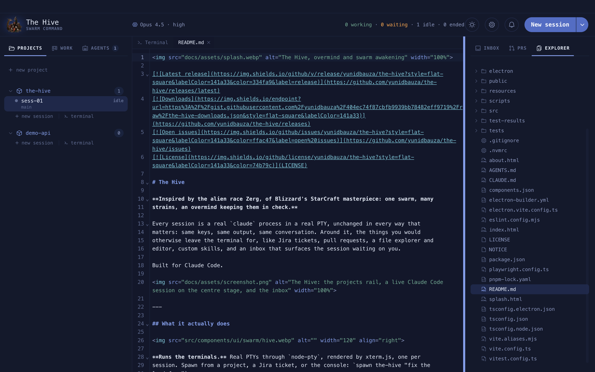
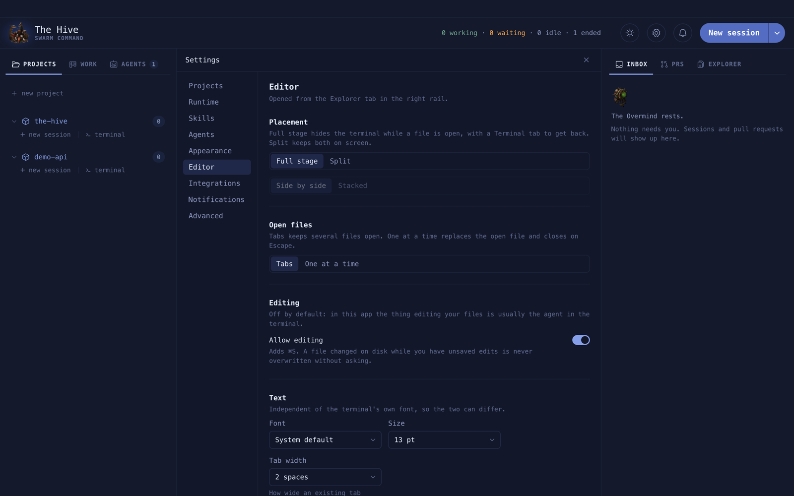

# Files and the editor

The **Explorer** tab (right rail) shows the repository of the session you are looking at.
Click a file to open it in a CodeMirror editor on the centre stage.

**On this page:** [Browse the project](#browse-the-project) · [Search](#search) ·
[Edit a file](#edit-a-file) · [When the file changes on disk](#when-the-file-changes-on-disk) ·
[Editor layouts](#editor-layouts) · [Limits](#limits)

## Browse the project

- The tree follows the active session. On the overmind it shows the last project you looked
  at. If a session moves into a worktree under `.claude/worktrees/`, the tree follows it.
- **Refresh** and **Collapse all** sit in the tab's header, with the current branch.
- Build and dependency folders are always hidden: `.git`, `node_modules`, `dist`, `out`,
  `.next`, `coverage`, `.turbo`, `target`, `__pycache__`, `.venv`. Other dotfiles show.
- The tree is read-only: no create, rename, move or delete.

## Search

**Search files** has two modes. **Name** matches file names; **Text** matches contents.
Both are literal and case-insensitive, never a regex.

**Example.** To find every file that mentions the ledger route, switch to **Text** and type
`/ledger`. Each matching file is listed with its matching lines; click one to open it.

Searches stop at 200 files or 500 matches and show `500+` when capped.

## Edit a file

Editing is on by default; turn off **Allow editing** in **Settings › Editor** for a
read-only viewer. Save with `⌘S`. Seventeen languages get syntax colours; anything else
opens as plain text.

## When the file changes on disk

Agents and git change files under you. The editor keeps up:

| Your buffer | What changed | What happens |
| --- | --- | --- |
| no unsaved edits | the file changed on disk | it reloads silently |
| unsaved edits | the file changed on disk | a banner offers **Reload** or **Keep mine** |
| any | you press `⌘S` after the file changed | nothing is written; **Overwrite** replaces the file |

The tree refreshes too, a moment after the change.

## Editor layouts

Set in **Settings › Editor**:

| Placement | Open files | Back to the terminal |
| --- | --- | --- |
| Full stage, Tabs | tab strip with a **Terminal** tab | select Terminal |
| Full stage, One at a time | filename bar with × | Escape or × |
| Split, Tabs | tabs over the editor pane | the terminal stays visible |
| Split, One at a time | filename bar with × | Escape or × |

Split can be side by side or stacked. Font, size, tab width, wrapping and line numbers are
there too.

## Limits

- Files over 1 MB, and binary files, are refused rather than opened.
- Open files are not restored after a restart.
- The editor only reaches files inside the project. A path or symlink that leads outside it
  is refused.
