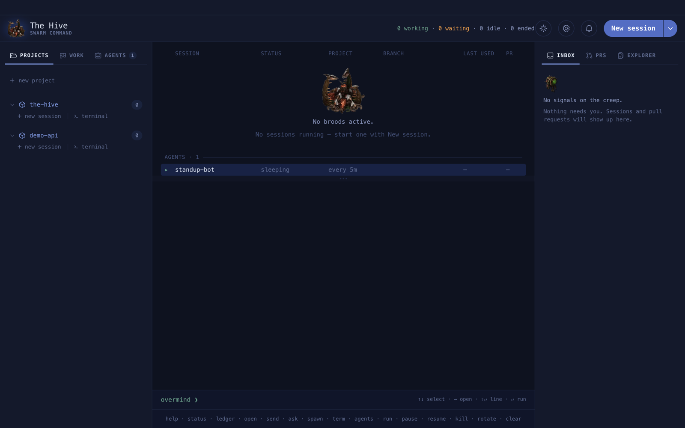
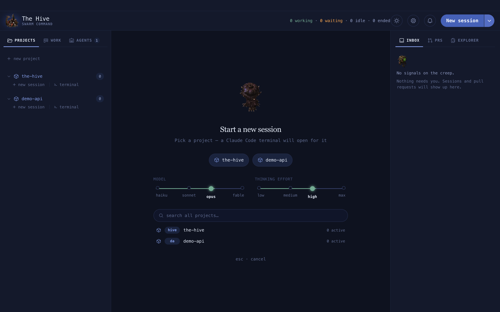

# Getting started

From download to a live Claude Code session in about two minutes.

**On this page:** [Install](#install) · [Requirements](#requirements) ·
[First launch](#first-launch) · [Map your first project](#map-your-first-project) ·
[Start your first session](#start-your-first-session) · [Run from source](#run-from-source) ·
[Next steps](#next-steps)

## Install

1. Download the `.dmg` from
   [the latest release](https://github.com/yunidbauza/the-hive/releases/latest).
   It is built for macOS on Apple silicon.
2. Drag **The Hive** into Applications and open it.
3. That is all. The app checks for updates on its own ([Updates](updates.md)).

If macOS says the app "is damaged", see
[Troubleshooting](troubleshooting.md#the-hive-is-damaged).

## Requirements

| Need | Check it with | Why |
| --- | --- | --- |
| Claude Code, signed in | `claude --version` | every session is a real `claude` |
| git | `git --version` | shows the branch each session is on |
| GitHub CLI, signed in | `gh auth status` | fills the PRs tab |
| A Jira account | optional | fills the Work tab |

The Hive reads your login shell's `PATH` at startup, so a `claude` or `gh` installed with
Homebrew is found even when you open the app from Finder.

## First launch

The window opens on the **overmind**: the fleet table in the middle, your projects on the
left, the inbox on the right. It is empty until you map a project.



On first launch The Hive writes `~/.hive/config.json` from a commented template. You never
have to open it; Settings edits it for you. See [The config file](configuration.md).

## Map your first project

A **project** is a folder The Hive can start sessions in, usually a git repository.

1. Click **+ new project** at the top of the left rail.
2. Choose the repository folder.
3. The project appears in the rail with a short **key** (two to four letters, like `hive`).
   You can type the key anywhere a project is asked for.

You can also add, rename, re-key or clone projects in **Settings › Projects**.


## Start your first session

1. Click **New session** in the header.
2. Type part of the project name and press **Enter**.
3. Pick a model and effort first if you want. The defaults are `opus` and `high`.



A terminal opens on the centre stage with `claude` running in your project. Type to it
exactly as you would in any terminal.

**Example.** The same thing from the overmind console, in one line:

```text
overmind ❯ spawn hive fix the flaky login test
```

When you are done, type `/done` in the session. The terminal closes and the row stays under
**ENDED**, ready to resume ([Sessions](sessions.md#finish-with-done)).

## Run from source

Linux has no release build, so run it from source there. The same works on macOS.

```sh
git clone https://github.com/yunidbauza/the-hive.git
cd the-hive
pnpm install
pnpm desktop:dev
```

You need Node 22 (`.nvmrc`) and pnpm. `node-pty` is a native addon: `pnpm install` handles it,
but keep a compiler around in case no prebuild matches your platform.

| Platform | Needs |
| --- | --- |
| macOS | Xcode Command Line Tools (`xcode-select --install`) |
| Linux | `build-essential` and `python3` |
| Windows | Not supported |

## Next steps

- [A tour of the window](tour.md): what every part of the screen does.
- [Sessions and terminals](sessions.md): statuses, names, `/done` and Resume.
- [The inbox](inbox.md): how The Hive tells you a session needs you.
