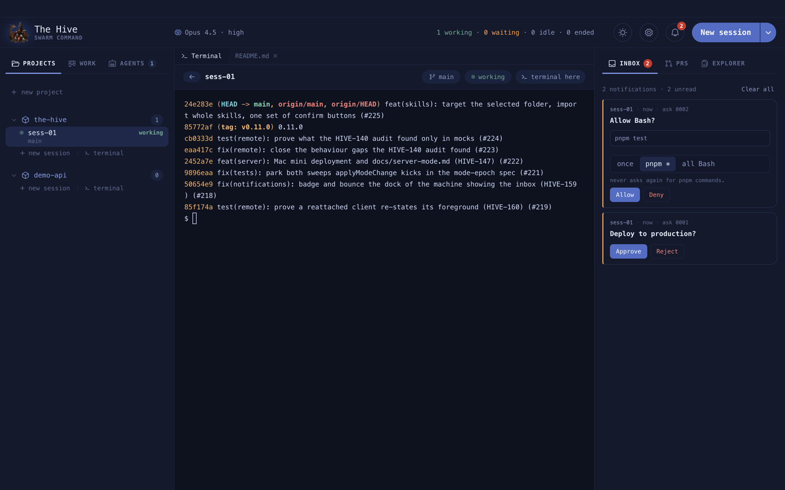
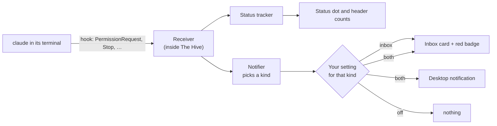
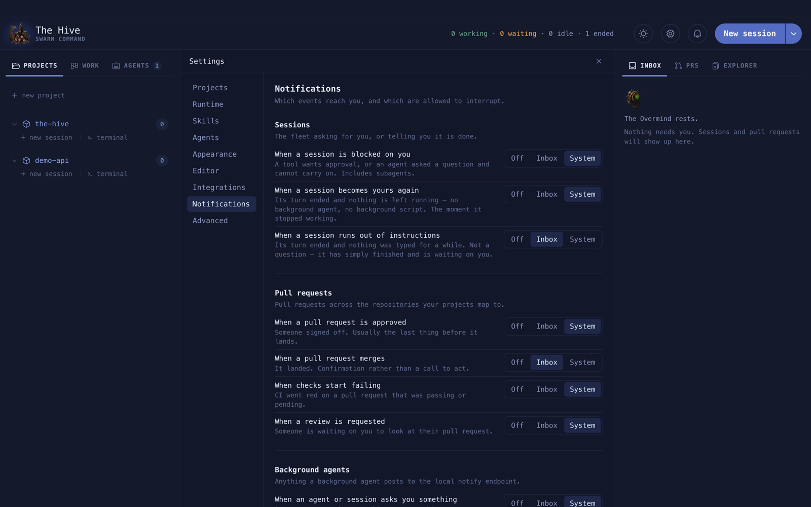

# The inbox

The inbox is the right rail's first tab. A card lands there when a session or agent needs
you, so you never have to watch every tab.

**On this page:** [How a notification is born](#how-a-notification-is-born) ·
[Card types](#card-types) · [Choosing what reaches you](#choosing-what-reaches-you) ·
[What clears a card](#what-clears-a-card)



## How a notification is born

The Hive writes a small hooks file for every session it starts. Claude Code then reports
what it is doing to a receiver inside the app, over loopback, with a per-session token.



| What Claude did | Kind raised |
| --- | --- |
| asked for permission, or asked a question | session blocked on you |
| finished its turn with nothing left running | session became yours again |
| sat idle waiting for input for a while | session ran out of instructions |
| an agent or session asked the overmind something | an agent asks you |

## Card types

- **Session cards.** Click to open the session. The card goes away on its own once the
  session stops waiting.
- **Question cards.** An agent or session asked something, with options. Click an option,
  or type **Your answer**. The answer goes back through the [ledger](ledger.md) and wakes
  the asker.
- **Permission cards.** An agent wants a tool outside its fence. The card shows the real
  call, like `pnpm test`, and a scope ladder: **once**, a command family like `pnpm *`, or
  **all Bash**. Anything wider than once is written into the agent's definition.
- **Update, clone and PR cards.** A new version, a finished clone, a PR approved, merged or
  failing checks.

**Example.** An agent asks before it deploys:

```text
Deploy to production?          [ Approve ]  [ Reject ]
```

Clicking **Approve** posts an answer to that ask. The agent wakes, reads it, and carries on.

## Choosing what reaches you

**Settings › Notifications** has one row per kind. Each is **Off**, **Inbox**, or **Both**
(inbox plus a desktop notification).



Or in the config file:

```json
"notifications": {
  "session.blocked": "both",
  "session.idle": "inbox",
  "session.input_needed": "off"
}
```

## What clears a card

- Opening the session or agent it is about.
- The session leaving "needs input": you approved, answered, or typed a refusal.
  Pressing Escape on a prompt sends no hook, so that card stays until the next prompt.
- **Clear all** at the top of the tab.

The inbox keeps the latest 50 cards and does not survive a restart. The dock icon shows
the unread count.
