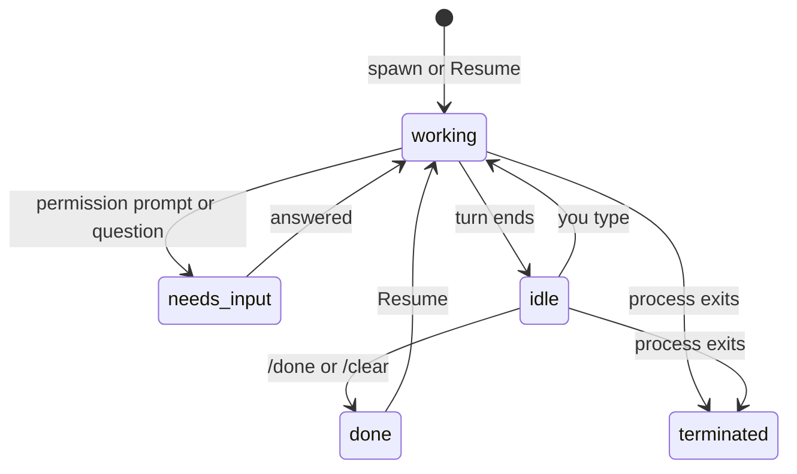

# Sessions and terminals

A **session** is a real `claude` running in a real terminal inside one of your projects.
A **terminal** is the same thing without Claude: a plain login shell.

**On this page:** [Start a session](#start-a-session) · [Talk to it](#talk-to-it) ·
[Status](#status) · [Names and branches](#names-and-branches) ·
[Finish with /done](#finish-with-done) · [Resume](#resume) ·
[Session history](#session-history) · [Terminals](#terminals)

## Start a session

Four ways, same result:

| From | Do this |
| --- | --- |
| The header | **New session**, type a project, **Enter** |
| The Projects rail | **+ new session** under a project (uses the picker's last model and effort) |
| A Jira ticket | **new session** on the ticket card; the session is named for the ticket |
| The console | `spawn <project> <task>` |


Models are `haiku`, `sonnet`, `opus` and `fable`. Effort is `low`, `medium`, `high` or
`max`. They become `--model` and `--effort` on the `claude` command line. Up to 24
sessions can run at once.

## Talk to it

There is no separate message box. Keys go straight to Claude Code's prompt, and the
terminal takes focus when it appears. While the shell boots, a cover hides the startup
noise until Claude is ready.

To type into a session without opening it, use the console:

```text
overmind ❯ send hive-3 run the tests again
routed → hive-3
```

## Status

Every session shows a coloured dot and a word.

| Label | Means | Your move |
| --- | --- | --- |
| **working** | a turn is in progress | wait |
| **needs input** | blocked on a permission prompt or a question | answer it; an inbox card is waiting |
| **idle** | the turn is over and nothing is running | your turn |
| **working (agents)** | Claude finished but a subagent is still running | wait |
| **working (scripts)** | a background shell is still running | wait, or carry on |
| **done** | ended on purpose (`/done`, `/clear`, or the app closed) | resume it if you want |
| **terminated** | the process is gone (`/exit`, `Ctrl+D`, a crash) | read the scrollback |



Status comes from Claude Code's own hooks, so "needs input" is exact rather than guessed.

## Names and branches

- Every session gets an id like `sess-07` that never changes.
- Claude titles the session from its conversation. The Hive tidies that into a short
  hyphenated name, at most four words.
- A ticket key always leads the name. Typing `work on HIVE-53` links the session to
  that Jira issue once Jira confirms it exists:
  `back key interception hive-53` becomes `HIVE-53-back-key-interception`.
- The console and rails accept either the id or the name, in any case.
- The branch is whatever git reports in the session's folder. A dash means none has been
  seen yet.

## Finish with /done

Type `/done` in a session. The Hive marks it done and closes its terminal when the turn
ends. The row stays under **ENDED** and is still readable.

`/done` is a skill The Hive adds to every session it starts. Your own skills can end with
it too ([Custom skills](skills.md)). If the app cannot be reached, the skill tells you to
type `/exit` instead.

## Resume

Rows ended by `/done` or by quitting the app show a **resume** button in the fleet table.
It restarts `claude --resume` on the same conversation and moves the row back up. A row
ended by `/clear` cannot be resumed: its terminal already carried on as a new session.

## Session history

The 20 most recent ended sessions survive a restart. They come back under ENDED, newest
first. The column **LAST USED** is when each one ended or last resumed.

## Terminals

A terminal is a login shell in a project with no Claude in it: no hooks, no cost, no
history, no resume. Its status is **at prompt** or the name of the program running in it,
like `vitest` or `vim`.

| Open one from | How |
| --- | --- |
| The Projects rail | **terminal** under a project |
| The header | chevron beside **New session** › **New terminal in…** |
| A session | **terminal here** in its bar, or ``Ctrl+` `` |
| The console | `term hive`, or `term` for beside the selected row |

A shell that exits normally disappears. One that dies shows why, with a **Close** button.
