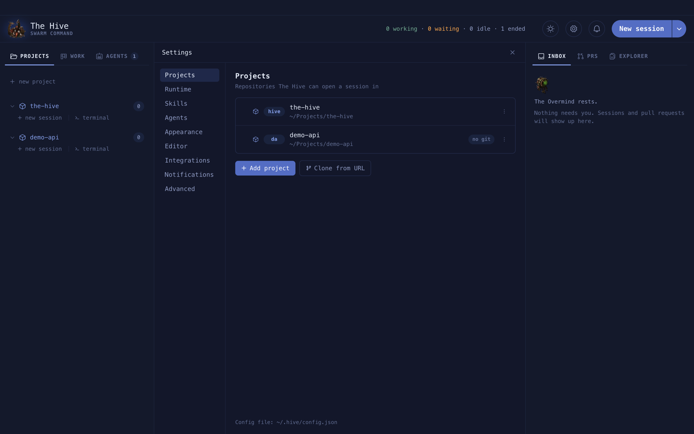
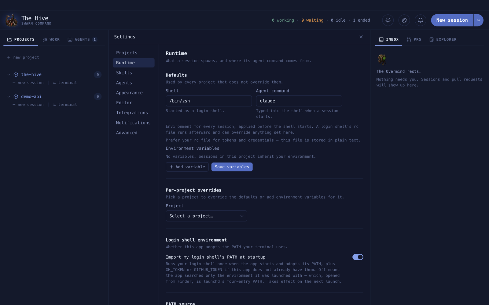
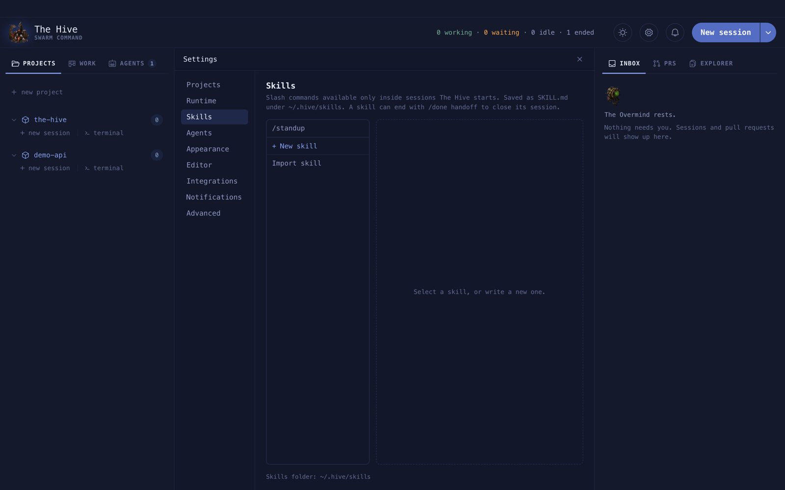
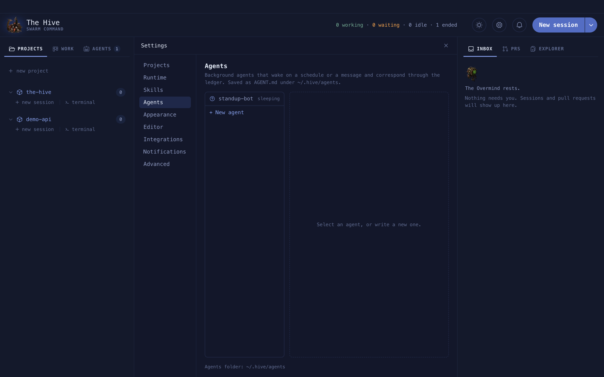
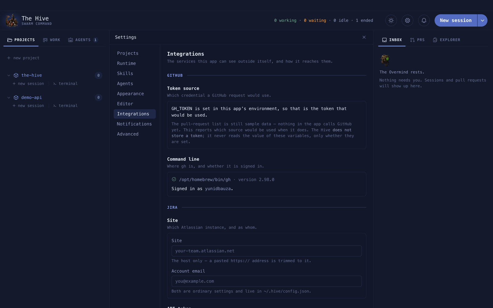
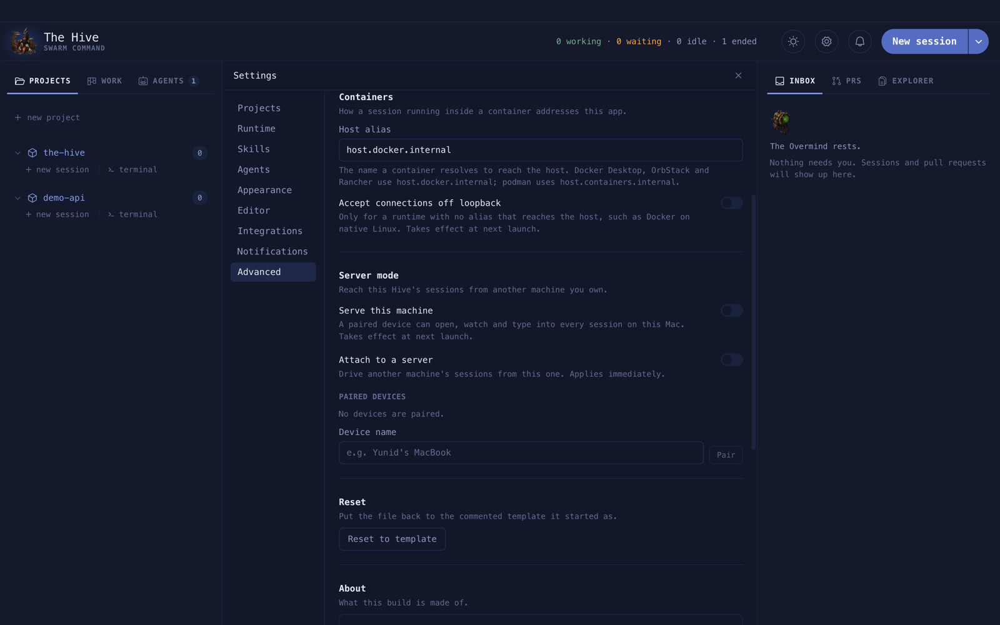

# Settings

Open Settings with the gear in the header. Nine sections, top to bottom. Almost everything
here is written to `~/.hive/config.json` ([The config file](configuration.md)); appearance
and editor preferences stay on this machine.

**On this page:** [Projects](#projects) · [Runtime](#runtime) · [Skills](#skills) ·
[Agents](#agents) · [Appearance](#appearance) · [Editor](#editor) ·
[Integrations](#integrations) · [Notifications](#notifications) · [Advanced](#advanced)

| Where it is stored | What |
| --- | --- |
| `~/.hive/config.json` | projects, runtime, Jira site and email, notifications, Slack, server and remote |
| Encrypted with the Keychain, in the app's data folder | the Jira API token, the Slack tokens, the remote device token |
| `~/.hive/skills/`, `~/.hive/agents/` | skills and agents |
| This machine only | appearance and editor preferences |

## Projects

Add a folder, **Clone from URL**, rename, re-point, reorder, remove, and edit each project's
two-to-four letter key.



## Runtime

What a session spawns. **Shell** (started as a login shell) and **Agent command**
(default `claude`) for every project, plus environment variables. **Per-project overrides**
change any of these for one project. **Import my login shell's PATH at startup** lets a
Finder-launched app find Homebrew tools. Two diagnostics explain why `claude` was or was not
found, and which variables your rc file overrode.



**Example.** Point one project at a wrapper script:

```json
{ "id": "nova-web", "path": "~/repos/nova-web", "claudeCommand": "~/bin/claude-nova" }
```

## Skills

Create, import and edit [custom skills](skills.md).



## Agents

Create and edit [agents](agents.md) with a form or as source.



## Appearance

Mode, [themes](themes.md), terminal font and scrollback, team name, density.

## Editor

Placement (Full stage or Split), split direction, Tabs or One at a time, **Allow editing**,
font, size, tab width, wrapping, line numbers. See [Files and the editor](explorer.md).

## Integrations

GitHub (which token `gh` would use, and where `gh` is), Jira (site, email, API token, JQL
override) and Slack (sign-in, Socket Mode). See [Jira and pull requests](work-and-prs.md)
and [Slack](slack.md).



## Notifications

One row per event: Off, Inbox or Both. See [The inbox](inbox.md#choosing-what-reaches-you).

## Advanced

- **Config file**: its path, **Reveal in Finder**, **Reload**. The file is not watched: edit
  it by hand, then Reload.
- **Containers**: the host alias, and **Accept connections off loopback**
  ([Containers](containers.md)).
- **Server mode**: **Serve this machine**, **Attach to a server**, paired devices
  ([Remote](remote.md)).
- **Reset to template**, **About** (versions), **Updates › Check now**, **Diagnostics**.


