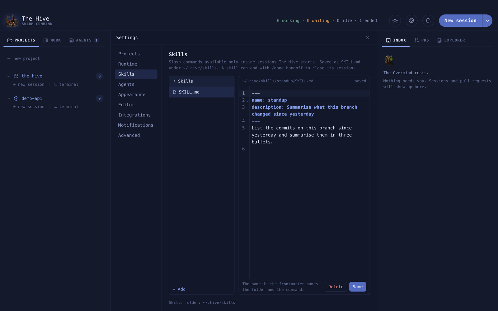

# Custom skills

A skill is a slash command you write once and every Hive session gets. Skills live under
`~/.hive/skills` and reach **only** sessions The Hive starts, never a `claude` you run
elsewhere.

**On this page:** [What a skill is](#what-a-skill-is) · [Create a skill](#create-a-skill) ·
[Import a skill](#import-a-skill) · [How skills reach a session](#how-skills-reach-a-session) ·
[Rules](#rules)

## What a skill is

A folder with a `SKILL.md` at its root, plus any files it needs.

```text
~/.hive/skills/
└── release-notes/
    ├── SKILL.md            # required: frontmatter + instructions
    ├── templates/
    │   └── notes.md
    └── scripts/
        └── collect.sh      # executable bit is kept
```

The folder name, the `name:` in the frontmatter and the command are one value: this skill
is `/release-notes`.

## Create a skill

**Settings › Skills › + New skill** opens a template with `name`, `description` and
`disable-model-invocation`. Filled in, it looks like this:

```markdown
---
name: standup
description: Summarise what this branch changed since yesterday
disable-model-invocation: true
---

List the commits on this branch since yesterday and summarise them in three bullets.
```

`disable-model-invocation: true` means the skill runs only when you type `/standup`; drop it
to let Claude pick the skill on its own.



Inside a skill: **New file**, **New folder**, **Add from your computer**, or drag files in.
Save with `⌘S`. Renaming `name:` renames the folder.

You can also just write the folder in your own editor. It is read again before every
spawn.

A skill may end with `/done handoff` to close its session when it finishes.

## Import a skill

**Import skill** takes a `.zip` (up to 100 MB) or a folder with `SKILL.md` at its root. The
skill is named by its frontmatter; a `SKILL.md` with no frontmatter or no `name` is refused.

## How skills reach a session

<picture>
  <source media="(prefers-color-scheme: dark)" srcset="../assets/diagrams/skills.dark.svg">
  
</picture>

A skill that fails validation shows in Settings with its reason and is not injected.

A session The Hive starts also loads your own Claude Code plugins, except the ones switched
off in **Settings › Skills › Manage Installed Plugins**; the row beside that button names the
ones that are off (or counts them, when the names would not fit). `workstream` and `superpowers` are
off by default, because their skills overlap the Hive's own: `workstream:work-on` beside
`hive:work-on` makes "work on HIVE-123" a coin toss. The switch only affects sessions the app
starts, from the next one on; `claude` started anywhere else still loads every plugin you
enabled. A hand edit of `disabledSessionPlugins` or a plugin installed while the app is open
reaches the next session too: the settings file is rewritten before every spawn. Agents load
none of your plugins either way.

## Skills the app ships

Some skills come with The Hive: the app's own `resources/skills/` is copied into
`~/.hive/skills` when the app starts: the implementation workflow, `/work-on` and
`/goal-on` at the front, `/brainstorm`, `/plan`, `/execute`, `/tdd`, `/debug`, `/verify`
and `/worktree` behind them, and the PR tail: `/ship`, `/review-pr-findings`, `/merge-pr`,
`/spec-deviation` and `/pr-review`, the multi-agent review the reviewer agent runs. They are ordinary skills once they are there. Edit one in Settings and
your version stays; an update changes only files you have not touched. Delete one and it
stays deleted. A skill the app stops shipping is never removed from your folder.

The record of what was seeded is `~/.hive/.seed.json`. To get a deleted shipped skill back,
remove its lines from that file and relaunch.

## Rules

| Rule | Detail |
| --- | --- |
| Name | lower-case letters, digits and dashes |
| Reserved | `done` belongs to the app |
| Size | up to 200 files, 5 MB per file, 4 folders deep |
| Skipped | symlinks and `.DS_Store` are listed but not copied |
| Remote | import is off while attached to a server |
