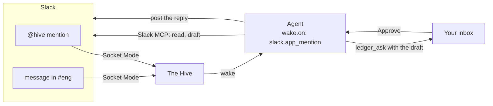

# Slack

Agents can read and post in Slack, and Slack can wake or command them.

**On this page:** [Two ways in](#two-ways-in) · [Sign in for agents](#sign-in-for-agents) ·
[Real-time events (Socket Mode)](#real-time-events-socket-mode) ·
[Command an agent from Slack](#command-an-agent-from-slack) ·
[Example: a mention watcher](#example-a-mention-watcher)

## Two ways in

| | What it gives | Needs |
| --- | --- | --- |
| **Slack MCP sign-in** | agents can search, read and post as you | one sign-in in Settings |
| **Socket Mode** | Slack events wake agents the moment they happen | your own Slack app and two tokens |



## Sign in for agents

1. **Settings › Integrations › Slack › Sign in to Slack.** A browser sign-in opens.
2. **Test** makes one real Slack call to catch a workspace that needs admin approval.
3. In the agent: `mcp: [slack]`, and grant the tools it may use without asking, like
   `mcp__slack__*`.

The Hive needs its own sign-in; a Slack login from another Claude plugin does not carry over.

## Real-time events (Socket Mode)

1. Create a Slack app with Socket Mode on. Copy its **App-level token** (`xapp-…`) and
   **Bot token** (`xoxb-…`).
2. In **Settings › Integrations › Slack**, turn on **Socket Mode** and paste both tokens.
   They are stored encrypted, never in the config file.
3. Give agents a Slack trigger:

| `wake.on` | Wakes on |
| --- | --- |
| `slack.mention` | nothing new: searches your mentions on wakes it already takes |
| `slack.app_mention` | every mention of your Hive app |
| `slack.channel:#eng` | every message in that channel (invite the app first) |

The socket only opens when some agent asks for one of the last two. A burst of messages
within three seconds is one wake, and wakes are at least a minute apart.

## Command an agent from Slack

Add Slack user ids to **Allowed to command**. Then, from an allowed user:

```text
@hive pr-patrol review PR 1234
```

starts a task run of `pr-patrol` with that task. Anyone not on the list is ignored. The config
side is:

```json
"slack": { "socketMode": true, "commanders": ["U08BA712189"] }
```

## Example: a mention watcher

```yaml
---
name: slack-watcher
description: Watches my Slack mentions and drafts replies for me to approve
icon: ph-slack-logo
wake:
  every: 5m
  check: always
  on: [ledger, slack.mention]
mcp: [slack]
tools: [Read, Grep, mcp__slack__*]
autonomy: ask
limits:
  turns: 40
  rotate_after: 50
---

You watch my Slack mentions.

On every wake, read your ledger inbox first. Then search Slack for messages that
mention me since your last run. For each one that needs a reply, draft it and ask
me to approve it with ledger_ask, putting the draft in the quote and offering
approve / edit / reject. Never post to Slack before I have approved the words.

When I approve, post the reply as me, then post one ledger_done naming the thread,
passing the permalink of what you posted as meta: { slack: { permalink: "…" } }.
If nothing mentions me, end your turn silently.
```

Leave `budget_usd` off or generous: a tight per-wake cap cuts off ordinary wakes. Container
agents cannot use `mcp: [slack]` yet.
