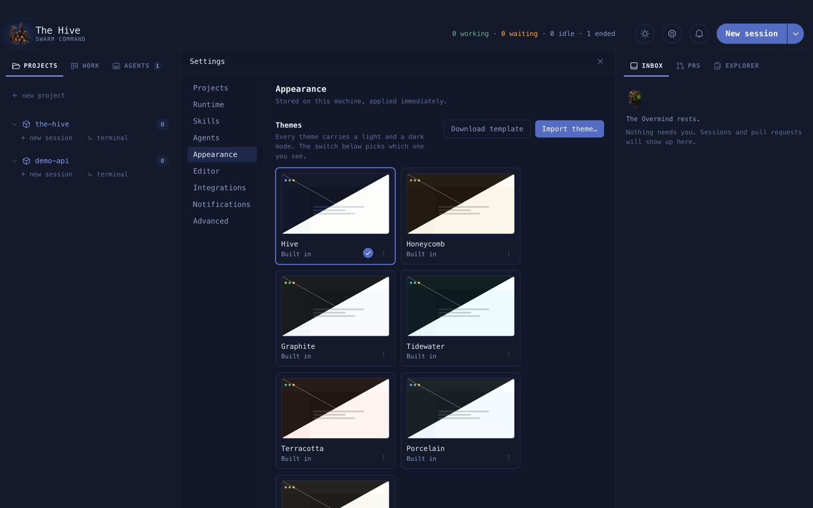
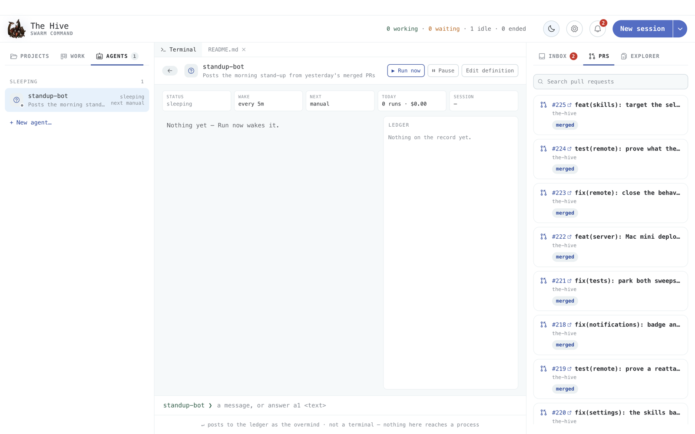
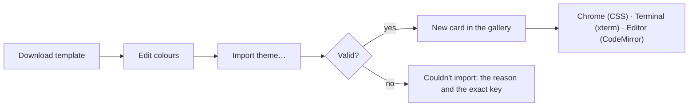

# Themes

One theme colours everything: the chrome, the terminal and the code editor. Every theme has a
light and a dark mode; the sun and moon in the header switch between them.

**On this page:** [Pick a theme](#pick-a-theme) · [Import your own](#import-your-own) ·
[The theme file](#the-theme-file) · [Other appearance settings](#other-appearance-settings)

## Pick a theme

**Settings › Appearance › Themes**. Seven ship with the app: Hive, Honeycomb, Graphite,
Tidewater, Terracotta, Porcelain and Cinder. Click a card to use it. The
card menu has **Export…** and, for imported themes, **Remove**.



**Mode** chooses System, Dark or Light. With System, the app follows macOS.



## Import your own

1. **Download template** saves `hive-theme-template.json`: a full copy of the Hive theme named
   "My theme".
2. Change the colours you want.
3. **Import theme…** and pick the file.



## The theme file

```json
{
  "hiveThemeVersion": 1,
  "name": "My theme",
  "author": "You",
  "version": "1.0.0",
  "modes": {
    "dark": {
      "ui":       { "bg": "#0f1326", "termBg": "#0b0f1f", "brand": "#8fa7f2" },
      "syntax":   { "keyword": "#8fa7f2", "comment": "#6b779f" },
      "terminal": { "bg": "#0b0f1f", "ink": "#e6e9f5" }
    },
    "light": { "ui": {}, "syntax": {}, "terminal": {} }
  }
}
```

This is trimmed. A real file needs every key in both modes, which is why starting from the
template is easiest.

| Group | Keys | Colours |
| --- | --- | --- |
| `ui` | 28 | the app chrome: backgrounds, borders, ink, brand, status colours |
| `syntax` | 11 | the editor: keyword, string, number, comment, selection… |
| `terminal` | 11 (+2 optional) | xterm: background, ink and the ANSI colours |

The importer refuses a file over 256 KB, a version other than 1, a missing mode, a bad
colour (naming the key), or a `terminal.bg` that differs from `ui.termBg`.

## Other appearance settings

| Setting | Options |
| --- | --- |
| Terminal | font, size, scrollback |
| Team | the name under the logo |
| Density | Comfortable or Compact |

Appearance is stored per machine in the app, not in the config file.
