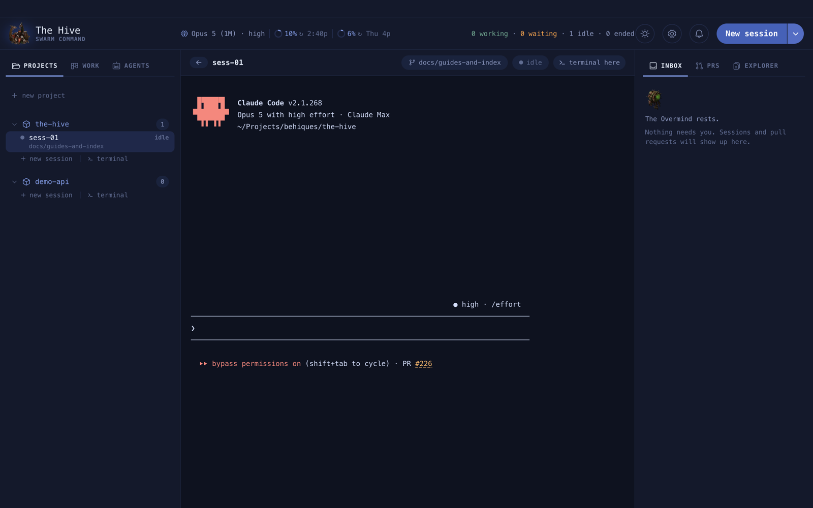

# A tour of the window

One header, two rails, and a centre stage that shows exactly one thing at a time.

**On this page:** [The layout](#the-layout) · [The header](#the-header) ·
[The left rail](#the-left-rail) · [The centre stage](#the-centre-stage) ·
[The right rail](#the-right-rail) · [Keyboard shortcuts](#keyboard-shortcuts)

## The layout

Both rails can be dragged wider or narrower, and collapsed to an icon strip: click the tab
that is already selected, or use the shortcut. The terminal never gets squeezed out.

## The header

| Part | What it does |
| --- | --- |
| Model chip and gauges | The focused session's model and effort, plus session and weekly usage when you sign in with a Claude plan |
| **0 working · 0 waiting · 1 idle · 0 ended** | Live counts across the fleet. Amber "waiting" means a session is blocked on you |
| Sun / moon | Switch between the theme's light and dark mode |
| Gear | Open Settings |
| Bell | Shows the Inbox tab. The red number is unread cards |
| **New session** | Opens the picker |
| Chevron beside it | **New terminal in…**: a plain shell in a project, no Claude |

## The left rail

| Tab | Shows |
| --- | --- |
| **Projects** | Each project with its sessions underneath, plus **+ new session** and **terminal** links |
| **Work** | Your Jira tickets. See [Jira and pull requests](work-and-prs.md) |
| **Agents** | Background agents grouped Awake, Sleeping, Paused. See [Agents](agents.md) |

## The centre stage

It shows one view, chosen in this order:

Hiding a terminal never closes it. Open Settings over a busy session and its scrollback is
still there when you come back.

The bar over a session shows its name, branch, status, and **terminal here**, which opens a
shell beside it in the same folder.

## The right rail

| Tab | Shows |
| --- | --- |
| **Inbox** | Cards for sessions and agents that need you. See [The inbox](inbox.md) |
| **PRs** | Your open and recently merged pull requests. See [Jira and pull requests](work-and-prs.md) |
| **Explorer** | The active session's repository. See [Files and the editor](explorer.md) |

## Keyboard shortcuts

| Action | macOS | Linux |
| --- | --- | --- |
| Back to the overmind | `⌘[` | `Ctrl+Shift+←` |
| Back to the overmind from an empty Claude prompt | `←` | `←` |
| Toggle the left rail | `⌘B` | `Ctrl+Shift+B` |
| Toggle the right rail | `⌘⌥B` | `Ctrl+Shift+Alt+B` |
| Terminal here, beside the current session | ``Ctrl+` `` | ``Ctrl+` `` |
| New line without sending | `Shift+Enter` | `Shift+Enter` |
| Copy / paste in a terminal | `⌘C` (with a selection) / `⌘V` | `Ctrl+Shift+C` / `Ctrl+Shift+V` |
| Interrupt | `Ctrl+C` | `Ctrl+C` with nothing selected |
| Save a file in the editor | `⌘S` | |

**Example.** You are in `ABC-123` and want to run the tests beside it without disturbing
Claude:

1. Press ``Ctrl+` ``. A terminal opens in the same folder, next to the session.
2. Run `pnpm test` there.
3. Press `⌘[` to go back to the overmind when you are done.

In the overmind console, `↑` and `↓` move through the fleet table and `Enter` on an empty
input opens the selected row. There is no shortcut for Settings yet.
