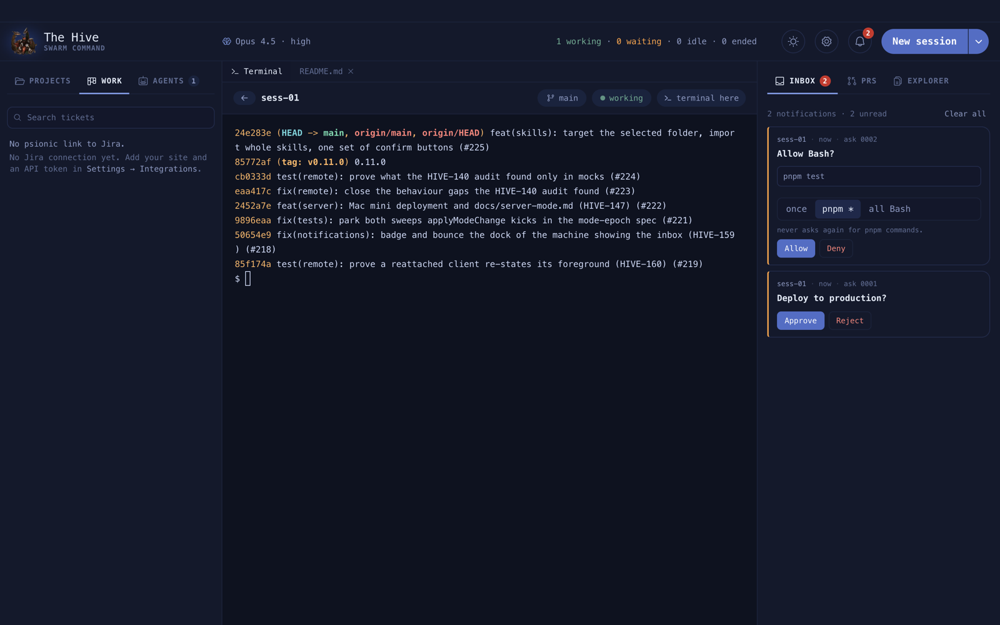
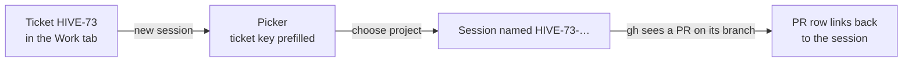
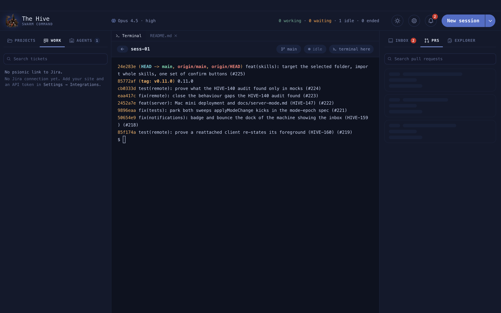

# Jira and pull requests

The **Work** tab (left rail) lists your Jira tickets. The **PRs** tab (right rail) lists your
GitHub pull requests. Both refresh every 60 seconds; overscroll either list to refresh now.

**On this page:** [Connect Jira](#connect-jira) · [The Work tab](#the-work-tab) ·
[Start a session from a ticket](#start-a-session-from-a-ticket) · [The PRs tab](#the-prs-tab)

## Connect Jira

Until Jira is connected the Work tab says so and points you here.



1. Open **Settings › Integrations** and scroll to **JIRA**.
2. **Site**: the bare hostname, like `your-team.atlassian.net`. A pasted `https://` is trimmed.
3. **Account email**: the address you sign in to Jira with.
4. **API token**: create one at id.atlassian.com, paste it, then **Test connection**.


The site and email live in `~/.hive/config.json`. The token does not: it is encrypted with
the macOS Keychain and never leaves the main process.

```json
"jira": {
  "site": "your-team.atlassian.net",
  "email": "you@example.com"
}
```

## The Work tab

By default it shows:

```text
assignee = currentUser() AND statusCategory != Done ORDER BY updated DESC
```

Set **JQL override** in the same Settings band to change it. Your query **replaces** the
default; it is not added to it.

On each ticket you can move it through its workflow, read and add comments, and see the PRs
and sessions linked to it. Type in **Search tickets** to search every ticket, any assignee,
any status; tick **Mine only** to narrow it.

## Start a session from a ticket

Click **new session** on a ticket. The picker opens with the ticket key filled in, because a
ticket does not say which repository it belongs to. Pick the project and press Enter.



The session is named for the ticket, and names stay unique: `HIVE-73`, then `HIVE-73-2`.

## The PRs tab



The list comes from the GitHub CLI, run as you, with two searches:

```text
is:pr author:@me is:open   sort:updated-desc
is:pr author:@me is:merged sort:updated-desc    (kept for 24 hours)
```

Each card links to GitHub and to the session whose branch made it. **Search pull requests**
filters the list. The Hive stores no GitHub token; `gh` uses its own login, or `GH_TOKEN` /
`GITHUB_TOKEN` if set.

If the tab stays empty, run `gh auth status`. **Settings › Integrations › Command line** shows
which `gh` The Hive found and who it is signed in as.
