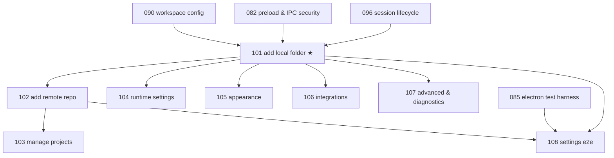

# 100 — Settings (epic)

| | |
|---|---|
| **ID** | HIVE-100 |
| **Epic** | Settings |
| **Depends on** | [082-preload-ipc-security.md](082-preload-ipc-security.md), [090-workspace-config.md](090-workspace-config.md), [096-session-lifecycle-claude.md](096-session-lifecycle-claude.md) |
| **Blocks** | every story in this epic |
| **Points** | 1 |
| **Location** | `app/src/features/settings/`, `app/electron/main/config/`, `app/electron/shared/config-contract.ts` |

This is the epic's overview doc, in the shape of
[000-overview.md](000-overview.md): the problem, the two structural shifts, the
decisions that bind every story under it, and the story list. It is not itself
implementable.

## The problem, stated exactly

A user launches the desktop app for the first time and tries to start a session.
It fails. The only thing the app told them was one line, on a console they were
never asked to open:

```
[hive] no workspace config found — wrote a template to /Users/me/.hive/config.json
```

That line is, today, the *entire* onboarding flow. It is written by
`writeTemplate` in `app/electron/main/config/index.ts` and it is the single
best thing the app does for a new user, which is the problem.

It gets worse if they follow it. Story [090](090-workspace-config.md) requires
every config entry's `id` to **match an existing fixture project id**:

> `id` **matches an existing fixture project id**. That is the whole mapping.

So the user can point `apfm-web` at a real directory — a project invented for a
demo — but they cannot add *their own* repository at all. There is no id to use.
The config file, the only configuration surface in the product, cannot express
the thing every user will want to do first.

That was the right call for 090. Its scope discipline is explicit that the file
exists "to make PTYs genuinely useful with the minimum real-world surface, so
the rest of this epic can be about terminals." The terminals are done. This
epic is the bill coming due.

## Where this sits

Phase 1 (000–071) built the prototype; phase 2 (080–099) made the terminals
real. This epic is the **first post-phase-2 epic**, numbered from 100. It is not
a "phase 3" — the backlog has never used that label and inventing one here would
imply a scope this epic does not have.

It resolves one item from [README](README.md#after-phase-2-not-written-as-stories-yet)'s
"After phase 2" list — the *project list* half of **Real project state**. The
other half (git branches, dirty state, worktrees) stays fixture-backed and is
still unwritten.

## The two structural shifts

Everything in this epic follows from two reversals. Both contradict a decision
recorded in the codebase, deliberately, and each story that touches one must say
so rather than quietly diverging.

### 1. The config becomes writable

`app/electron/shared/ipc-contract.ts` currently says, in the doc comment on
`HiveBridge.config`:

> Read-only from the renderer, deliberately. `reload()` re-reads the file the
> *user* edited; there is **no `set`**, because a settings UI that writes this
> file is out of scope and a bridge verb that can write to disk is not something
> to add speculatively.

It is no longer speculative. The bridge gains mutating verbs, and the comment
gets rewritten rather than deleted — the reasoning was sound and the conditions
changed.

**The security posture does not relax.** Story [082](082-preload-ipc-security.md)'s
rules apply unchanged to every new channel:

- `assertSender` first, then a hand-written payload guard, no casts, `__proto__`
  rejected.
- The renderer is untrusted input. A path arriving from the renderer is
  **re-validated in main from scratch** — expanded, made absolute, `realpath`'d,
  confirmed to be a directory — exactly as a path arriving from the file is.
- Writes are confined to the config file. No verb takes a destination path.

### 2. The config becomes the source of truth for the project list

Today `Project` is `{ id, icon }` (`app/src/types/entity.ts:40`), it comes from
`src/data/fixtures.ts`, and config maps onto it by id. After this epic the
config **declares** projects, with a real name and a real path, and the fixture
list is the fallback rather than the schema.

This is what supersedes 090's id-matching rule. Story
[101](101-settings-add-local-project.md) carries the change and records it in
090's `UPDATED SPECS` section.

The merge rule, decided once here so no story re-litigates it:

| Situation | The project list is |
|---|---|
| No config snapshot (browser demo, first frames of launch) | the fixtures', unchanged |
| Snapshot with no projects | the fixtures', unchanged, plus the empty-state affordance |
| Snapshot with projects | the config's, **plus** any fixture project that still owns live fixture sessions, marked `demo` |

The third row is the load-bearing one. The work panel, the PR panel, the inbox
and the orchestrator table all reference fixture sessions by `entity.project`
(`hive-store.ts:569`); dropping fixture projects the moment a real one is added
would orphan every one of those panels. Marking them `demo` is honest and costs
one field. A config project and a fixture project sharing an id collapse to a
single row and **config wins** — that is the upgrade path for anyone who already
mapped `apfm-web` under 090.

## Decisions that bind every story

### Settings is a full-stage overlay, not a route and not a modal

`src/lib/resolve-view.ts` is a pure four-state machine with a documented
precedence. Settings becomes its fifth state, following the picker's proven
shape exactly:

```ts
export type ViewState = 'settings' | 'picker' | 'orchestrator' | 'session' | 'agent';
```

- A `settings: boolean` flag in `ui-store`, which **does not change
  `activeTab`** — closing settings must return the user to the terminal they
  were watching, and that only works if the tab underneath is untouched. This is
  the same reasoning the picker's precedence comment already records.
- **Settings wins over the picker**, and `openSettings()` closes it. The
  realistic path into settings *is* the picker discovering it has no projects to
  offer; two stacked overlays would be the result of doing anything else.
- Not a `Dialog`. `src/components/ui/dialog.tsx` exists, but a modal floating
  over thirteen live terminals fights the attention model the whole app is built
  around, and the surface needs room for a section list.
- Reached from a gear in the header, from `Cmd+,`, and from the picker's empty
  state.

### The section list exists from the first story

Story 101 ships **one** section (Projects) inside a nav that is already built to
hold six. A settings page that starts as a single pane and grows a nav in story
104 is a settings page that gets redesigned twice.

### One write path, whole-file and atomic

Every mutation goes through a single `writeConfig` in
`app/electron/main/config/`, never a per-field patch:

1. Read the file that is on disk **now** (not the cached snapshot — the user may
   have edited it in an editor since load).
2. Apply the mutation in memory.
3. Validate the whole result, with the same `parse`/`resolve` code the read path
   uses. A write that would produce a file the reader rejects is refused before
   anything touches disk.
4. Write to a temp file in the same directory and `rename` over the target.
   A half-written config is the one failure mode that would make the app
   unlaunchable, and `rename` is the only cheap way to make it impossible.
5. Return the fresh snapshot. **Every mutating verb returns `ConfigSnapshot`**,
   so the renderer never guesses and never has to follow a write with a reload.

**Unknown top-level keys and `"//"` comment keys are preserved** across a write.
The template is deliberately comment-heavy (`template.ts` explains why); a UI
that silently ate the user's comments the first time they clicked a button would
make hand-editing and the settings page mutually exclusive.

### Schema v2, migrated on first write

`CONFIG_VERSION` goes to `2`. A v1 file (`{ id, path }` entries) is read
normally, its entries upgraded in memory — `name` from the directory basename,
a default `icon` — and **written as v2 only when the user first saves
something**. Reading someone's file and rewriting it before they asked for
anything is not a migration, it is a surprise.

### Native dialogs are owned by main

The renderer never invents a filesystem path. Directory selection is
`dialog.showOpenDialog` in the main process, behind a verb that takes no path
and returns the user's choice. The renderer echoes that path back on the
subsequent `addProject` call, and **main re-validates it completely** — the
dialog is a UX step, not a capability grant, and main's validation is the actual
gate either way.

## Stories

| # | Story | Pts | What it settles |
|---|---|---|---|
| **101** | [**Add a local project folder**](101-settings-add-local-project.md) | **13** | The vertical slice: settings overlay, the write path, schema v2, native folder picker, add + remove, project spawnable |
| 102 | Add a remote repository by URL | 8 | `git clone` into a chosen parent directory, run **in a PTY** so credential and host-key prompts are answerable, progress in the terminal the user already trusts, failure leaves no half-clone |
| 103 | Manage projects — rename, re-point, reorder | 5 | Display name separate from id, re-point a moved repo, drag order that the left rail honours, remove-with-confirmation for a project owning live sessions |
| 104 | Runtime settings — shell, command, env | 5 | `shell` and `claudeCommand` editable in the UI, per-project overrides, per-project env vars, a PATH diagnostic that says why `claude` was not found |
| 105 | Appearance settings | 5 | Theme incl. **system** (today `ui-store` has only `'dark' \| 'light'`), terminal font family and size, scrollback limit, rail density — the first settings that persist *renderer* state and so need their own storage decision |
| 106 | Integrations & notifications | 5 | `gh` CLI detection and auth status, the token source for the PR panel, OS notification preferences per event class |
| 107 | Advanced & diagnostics | 3 | Reveal config in Finder, explicit reload, reset to template, versions and PTY diagnostics from `appInfo()`, log location |
| 108 | Settings e2e & config-write conformance | 3 | Playwright `_electron` specs for the add/remove round trip against a `HIVE_CONFIG_PATH` sandbox; crash-during-write leaves the old file intact |

**8 stories · 47 points** (plus this doc, 1 pt).

### Sequencing

1. **101 alone.** It is the whole spine — overlay, write path, schema, bridge
   surface. Nothing else can start, and once it lands the reported failure is
   fixed.
2. **102 → 103.** Cloning is the second half of "add a project"; managing them
   only matters once there are several.
3. **104, 105, 106, 107 in any order.** Independent sections against a settled
   surface. 105 is the one with a hidden decision (renderer-state persistence),
   so it should not be last.
4. **108 last**, and only last — a conformance suite written before the surface
   it covers gets written against intentions.



## Explicitly not in this epic

- **Real git state.** Branch, dirty, worktrees, `spawn` creating a branch. This
  epic makes the project *list* real; it does not make the project *state* real.
  Still fixtures, still the largest known gap after this.
- **Multi-window or multi-workspace.** One window, one config file.
- **Sync, profiles, or a hosted account.** The config is a local file.
- **A plugin or extension surface.**
- **Watching the config file.** 090 declined a watcher and its reasoning still
  holds — a config that changes under a live session raises questions about the
  PTY already running in the old directory. Now that the app writes the file
  too, the explicit reload in 107 is the answer.
