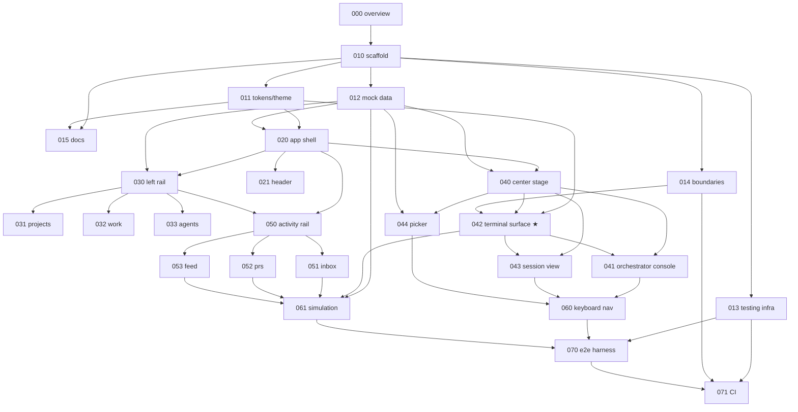
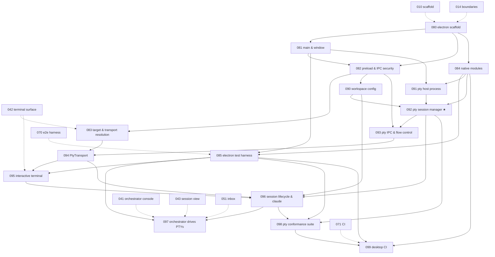

# The Hive — Story Backlog

Stories for the concept in `../concept/`, across two phases:

- **Phase 1 — static React prototype** (000–071). A **React + TypeScript** app with
  real **xterm.js** surfaces fed by mock data. No backend; the terminal transport is
  the designed seam for the future local PTY.
- **Phase 2 — Electron desktop app** (080–099). The same renderer, unmoved, inside an
  Electron shell, with **real local PTYs running Claude Code**. This is the phase where
  the seam is cashed in.

Context and decisions: [000-overview.md](000-overview.md).

The backlog is modeled on the architecture of `incorpHQ/incorpx` — feature slices with
lint-enforced boundaries, Zustand with selector hooks, a `tests/` mirror with an 80%
coverage gate, and a thin `AGENTS.md` over deep-dive docs. See
[000-overview.md](000-overview.md) → *Architecture baseline* for the full mapping and
for what we deliberately left behind.

## Conventions

- One story per file, numbered by epic decade. Each has an ID (`HIVE-0xx`), explicit
  **Depends on / Blocks** links, a **Location** naming where the code lands, a
  **Points** estimate, a user story, spec, tests, and acceptance criteria.
- Specs quote the concept's exact values (colors, sizes, copy) — the concept file is
  the visual source of truth when a story is silent.
- A story is *done* when its acceptance boxes check off against the running app **and**
  its tests are green under the coverage gate ([013](013-testing-infrastructure.md)).

## Index

| # | Story | Epic | Pts |
|---|---|---|---|
| 000 | [Overview & prototype scope](000-overview.md) | Foundation | 1 |
| 010 | [Project scaffold](010-project-scaffold.md) | Foundation | 5 |
| 011 | [Design tokens & theming](011-design-tokens-and-theming.md) | Foundation | 3 |
| 012 | [Mock data layer](012-mock-data-layer.md) | Foundation | 8 |
| 013 | [Testing infrastructure](013-testing-infrastructure.md) | Foundation | 3 |
| 014 | [Architecture boundaries & lint enforcement](014-architecture-boundaries.md) | Foundation | 3 |
| 015 | [Project docs & agent guidance](015-project-docs.md) | Foundation | 2 |
| 020 | [App shell layout](020-app-shell-layout.md) | Shell | 3 |
| 021 | [Header](021-header.md) | Shell | 5 |
| 030 | [Left rail (container & tabs)](030-left-rail.md) | Left rail | 3 |
| 031 | [Projects panel](031-projects-panel.md) | Left rail | 3 |
| 032 | [Work panel](032-work-panel.md) | Left rail | 3 |
| 033 | [Agents panel](033-agents-panel.md) | Left rail | 2 |
| 040 | [Center stage (view states)](040-center-stage.md) | Center stage | 5 |
| 041 | [Orchestrator console](041-orchestrator-console.md) | Center stage | 8 |
| 042 | [**Terminal surface (xterm.js)** — core](042-terminal-surface.md) | Center stage | 13 |
| 043 | [Session / agent terminal view](043-session-view.md) | Center stage | 5 |
| 044 | [New session picker](044-new-session-picker.md) | Center stage | 5 |
| 050 | [Activity rail (container & tabs)](050-activity-rail.md) | Activity rail | 2 |
| 051 | [Inbox panel](051-inbox-panel.md) | Activity rail | 3 |
| 052 | [PRs panel](052-prs-panel.md) | Activity rail | 3 |
| 053 | [Activity feed panel](053-activity-feed-panel.md) | Activity rail | 2 |
| 060 | [Keyboard navigation](060-keyboard-navigation.md) | Cross-cutting | 5 |
| 061 | [Simulation mode](061-simulation-mode.md) | Cross-cutting | 5 |
| 070 | [Playwright e2e harness](070-e2e-harness.md) | Cross-cutting | 5 |
| 071 | [CI workflow](071-ci-workflow.md) | Cross-cutting | 2 |
| 080 | [Electron scaffold (electron-vite)](080-electron-scaffold.md) | Desktop shell | 5 |
| 081 | [Main process & window lifecycle](081-main-process-window.md) | Desktop shell | 5 |
| 082 | [Preload bridge & IPC security](082-preload-ipc-security.md) | Desktop shell | 5 |
| 083 | [Runtime target detection & transport resolution](083-runtime-target-transport.md) | Desktop shell | 3 |
| 084 | [Native modules & dev/build workflow](084-native-modules-dev-workflow.md) | Desktop shell | 3 |
| 085 | [Electron test harness (Playwright `_electron`)](085-electron-test-harness.md) | Desktop shell | 8 |
| 090 | [Workspace config & real project paths](090-workspace-config.md) | Real terminals | 3 |
| 091 | [PTY host process (`utilityProcess`)](091-pty-host-process.md) | Real terminals | 8 |
| 092 | [**PTY session manager (node-pty)** — core](092-pty-session-manager.md) | Real terminals | 8 |
| 093 | [PTY IPC protocol & flow control](093-pty-ipc-protocol.md) | Real terminals | 5 |
| 094 | [`PtyTransport` — the seam swap](094-pty-transport.md) | Real terminals | 5 |
| 095 | [Interactive terminal surface](095-interactive-terminal-surface.md) | Real terminals | 5 |
| 096 | [Session lifecycle & `claude` bootstrap](096-session-lifecycle-claude.md) | Real terminals | 8 |
| 097 | [Orchestrator & inbox drive real PTYs](097-orchestrator-drives-ptys.md) | Real terminals | 5 |
| 098 | [PTY conformance suite](098-pty-conformance-suite.md) | Real terminals | 8 |
| 099 | [Desktop CI](099-desktop-ci.md) | Real terminals | 3 |

**42 stories · 194 points.** Phase 1: 26 stories · 107 pts. Phase 2: 16 stories · 87 pts.

| Epic | Phase | Stories | Points |
|---|---|---|---|
| Foundation | 1 | 000, 010, 011, 012, 013, 014, 015 | 25 |
| Shell | 1 | 020, 021 | 8 |
| Left rail | 1 | 030, 031, 032, 033 | 11 |
| Center stage | 1 | 040, 041, 042, 043, 044 | 36 |
| Activity rail | 1 | 050, 051, 052, 053 | 10 |
| Cross-cutting | 1 | 060, 061, 070, 071 | 17 |
| **Desktop shell** | 2 | 080, 081, 082, 083, 084, 085 | 29 |
| **Real terminals** | 2 | 090, 091, 092, 093, 094, 095, 096, 097, 098, 099 | 58 |

## Jira

The backlog lives in the **HIVE** project on `behiques.atlassian.net`. Doc IDs
(`HIVE-0xx`, the file numbering) are *not* Jira keys — Jira assigned its own. The
mapping:

| Epic | Jira key | Stories (doc → Jira) |
|---|---|---|
| Foundation | `HIVE-1` | 000→`HIVE-7`, 010→`HIVE-8`, 011→`HIVE-9`, 012→`HIVE-10`, 013→`HIVE-11`, 014→`HIVE-12`, 015→`HIVE-13` |
| Shell | `HIVE-2` | 020→`HIVE-14`, 021→`HIVE-15` |
| Left rail | `HIVE-3` | 030→`HIVE-16`, 031→`HIVE-17`, 032→`HIVE-18`, 033→`HIVE-19` |
| Center stage | `HIVE-4` | 040→`HIVE-20`, 041→`HIVE-21`, 042→`HIVE-22`, 043→`HIVE-23`, 044→`HIVE-24` |
| Activity rail | `HIVE-5` | 050→`HIVE-25`, 051→`HIVE-26`, 052→`HIVE-27`, 053→`HIVE-28` |
| Cross-cutting | `HIVE-6` | 060→`HIVE-29`, 061→`HIVE-30`, 070→`HIVE-31`, 071→`HIVE-32` |
| **Desktop shell** | `HIVE-33` | 080→`HIVE-35`, 081→`HIVE-36`, 082→`HIVE-37`, 083→`HIVE-38`, 084→`HIVE-39`, 085→`HIVE-40` |
| **Real terminals** | `HIVE-34` | 090→`HIVE-41`, 091→`HIVE-42`, 092→`HIVE-43`, 093→`HIVE-44`, 094→`HIVE-45`, 095→`HIVE-46`, 096→`HIVE-47`, 097→`HIVE-48`, 098→`HIVE-49`, 099→`HIVE-50` |

Each Jira Story carries its full spec (tables, code blocks, acceptance checkboxes), its
story-point estimate, and real **Blocks / is blocked by** links mirroring the graphs
below — 45 links for phase 1, 40 for phase 2 (9 of which cross the phase boundary).
The rendered phase-1 graph is attached to the Foundation epic.

**These markdown files remain the source of truth.** When a story changes here, update
its Jira issue too; nothing syncs automatically.

## Dependency graph — phase 1 (prototype)

## Dependency graph — phase 2 (desktop)

Dashed edges cross the phase boundary: the phase-1 story a desktop story builds on.

## Suggested sprint slicing

1. **Walking skeleton**: 010 → 011 → 012 → 013 → 014 → 020 — dark shell renders with
   the store, and the fences plus the test harness exist *before* there is anything to
   fence in. Doing 013/014 later means retrofitting, which is how they get skipped.
2. **See the fleet**: 021, 030, 031, 015 — header counts + project tree navigate (to an
   empty center); docs seeded while the conventions are fresh.
3. **The terminal** *(the milestone that matters)*: 040, 042, 043 — open any session,
   real xterm, send a message, watch it ack.
4. **Command the hive**: 041, 044, 060 — orchestrator table + commands + picker +
   keyboard.
5. **Attention loop**: 050, 051, 052, 053, 032, 033 — inbox→terminal jump, PRs, feed.
6. **Make it breathe & prove it**: 061, 070, 071 — simulation for demos, e2e specs that
   actually verify the terminal, CI that enforces all of it.

Phase 2 continues the numbering:

7. **It runs on the desktop**: 080 → 081 → 084 → 082 → 083 — the identical UI in an
   Electron window, still on fixtures, with the security posture and the native-module
   toolchain settled *before* anything native exists. 085 lands here too: the harness
   has to precede the thing it tests, or it gets skipped.
8. **The terminal is real** *(the milestone that matters)*: 090 → 091 → 092 → 093 →
   094 → 095 — a config file, a supervised pty host, a real pty, and the seam swapped.
   Ends with typing into a live shell.
9. **Sessions and proof**: 096 → 097 → 098 → 099 — `claude` bootstraps in the right
   repo, the coordination layer drives real PTYs, and conformance plus CI make the
   whole claim testable.

**084 before 092.** The native-module toolchain is a prerequisite disguised as a
chore; discovering the Electron ABI problem while debugging a PTY means debugging two
things at once.

## After phase 2 (not written as stories yet)

- **Detecting `waiting`.** The attention model's central status is not derivable from
  pty output ([096](096-session-lifecycle-claude.md)) — a TUI thinking and a TUI
  asking look identical. The real mechanism is a Claude Code hook writing a structured
  event the app watches. This is the immediate follow-up epic and the largest known gap.
- **Packaging & distribution.** electron-builder, code signing, notarisation, asar with
  the native binary unpacked ([084](084-native-modules-dev-workflow.md)), auto-update,
  crash reporting.
- **Windows.** ConPTY, the MSVC toolchain, and window chrome. A known gap, deliberately
  not attempted ([099](099-desktop-ci.md)).
- **Session persistence.** Resuming a Claude Code conversation, reattaching to a pty
  that outlived the app, restoring the fleet on launch.
- **Real project state.** Git branches, dirty state, worktrees, and `spawn` creating a
  branch — replacing the fixtures that [090](090-workspace-config.md) deliberately left
  alone.
- **Background agents as real processes.** Long-lived non-`claude` workers
  ([033](033-agents-panel.md)) still run on fixture transcripts.
